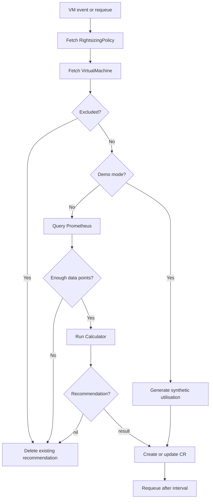

# Chapter 4: Recommendation Controller

## Introduction

The Recommendation Controller is the heart of OVRO. It ties together the Prometheus Client, Calculator, and CRD data model into a continuous reconciliation loop. Every time a VirtualMachine is created, updated, or on a timer, this controller fetches metrics, runs the calculator, and creates or updates a `RightsizingRecommendation` CR. It also manages the approval token lifecycle (reminders and expiry). Think of it as the assembly line: raw metrics go in, actionable recommendations come out.

## How It Works

The controller uses controller-runtime's reconciliation pattern. Instead of watching its own CRD, it watches KubeVirt `VirtualMachine` resources (an external, non-native type) using the dynamic client and unstructured objects:

```go
// internal/controller/rightsizingrecommendation_controller.go

func (r *RightsizingRecommendationReconciler) SetupWithManager(mgr ctrl.Manager) error {
    vmGVK := schema.GroupVersionKind{Group: "kubevirt.io", Version: "v1", Kind: "VirtualMachine"}
    vm := &unstructured.Unstructured{}
    vm.SetGroupVersionKind(vmGVK)

    return ctrl.NewControllerManagedBy(mgr).
        Named("rightsizingrecommendation").
        WatchesRawSource(source.Kind(mgr.GetCache(), vm,
            &handler.TypedEnqueueRequestForObject[*unstructured.Unstructured]{})).
        Complete(r)
}
```

This means the controller is triggered whenever a VM changes. Combined with periodic requeue (`RequeueAfter`), it re-evaluates VMs on a configurable schedule.

## The Reconciliation Flow



### Step by Step

1. **Fetch policy** — loads the cluster-wide `RightsizingPolicy` CR (or defaults).
2. **Fetch VM** — gets the VirtualMachine via unstructured client, extracts CPU cores, memory, and exclusion status.
3. **Check exclusion** — if `rightsizing.redhatconsulting.io/exclude: "true"` is set, delete any existing recommendation and skip.
4. **Query metrics** — calls the Prometheus client. In demo mode, generates synthetic data instead.
5. **Minimum data check** — requires at least 50% coverage of 7 days (5,040 data points at 1-minute resolution). This prevents premature recommendations on newly created VMs.
6. **Run calculator** — passes metrics and policy thresholds to `calculator.Analyze()`.
7. **Persist** — creates or updates the `RightsizingRecommendation` CR.

## Approval Token Lifecycle

When a recommendation is in `awaiting-approval` state, the controller manages two timelines:

```go
if rec.Status.State == rightsizingv1alpha1.StateAwaitingApproval {
    if rec.Status.NotifiedAt != nil {
        elapsed := time.Since(rec.Status.NotifiedAt.Time)

        if elapsed > 14*24*time.Hour {
            // Token expired — reset to pending
            rec.Status.State = rightsizingv1alpha1.StatePending
            rec.Status.Owner = ""
            rec.Status.ApprovalToken = ""
            // ...
        } else if elapsed > 7*24*time.Hour && rec.Status.ReminderSentAt == nil {
            // Send reminder via all channels except ServiceNow
            r.Notifier.SendAllExcept(ctx, n, []string{"servicenow"})
            rec.Status.ReminderSentAt = &now
        }
    }
}
```

- **7-day reminder** — sends a follow-up notification to the owner (excluding ServiceNow, since the ticket already exists).
- **14-day expiry** — resets the recommendation to `pending`, clearing approval state so it can be re-triggered.

## Demo Mode

When `OVRO_DEMO_MODE=true`, the controller generates synthetic recommendations for every VM without querying Prometheus:

```go
func demoUtilization(cpuCores, memoryGiB int32, vmName string) *VMUtilization {
    u := &VMUtilization{
        CurrentCPUCores:  cpuCores,
        CurrentMemoryGiB: memoryGiB,
        DataPoints:       20160,
    }
    if demoDirection(vmName) == string(rightsizingv1alpha1.DirectionDownsize) {
        u.CPUP95Percent = 25.0
        u.MemoryP95Percent = 30.0
    } else {
        u.CPUP95Percent = 92.0
        u.MemoryP95Percent = 88.0
    }
    return u
}
```

The direction is deterministic based on the VM name (using a simple hash), so half the VMs get downsize recommendations and half get upsize. This makes demos predictable and repeatable.

## Reconciler Struct

```go
type RightsizingRecommendationReconciler struct {
    client.Client
    Scheme            *runtime.Scheme
    PromClient        PrometheusQuerier
    Log               logr.Logger
    DemoMode          bool
    Notifier          *notifier.Dispatcher
    ApprovalRouteHost string
}
```

The `PrometheusQuerier` interface allows injecting a mock client in tests:

```go
type PrometheusQuerier interface {
    GetVMUtilization(ctx context.Context, vmName, namespace string, lookbackDays int) (*VMUtilization, error)
}
```

## Key Takeaways

- The controller watches KubeVirt VMs via unstructured objects, not a typed Go client.
- It combines Prometheus data, calculator logic, and CRD persistence in a single reconciliation loop.
- The approval token lifecycle (7-day reminder, 14-day expiry) is managed within the reconciler.
- Demo mode generates synthetic data for testing without Prometheus.
- The `PrometheusQuerier` interface enables unit testing without a real metrics backend.

## Next Steps

When a recommendation is approved, someone needs to actually change the VM. That's the VM Applier's job.
