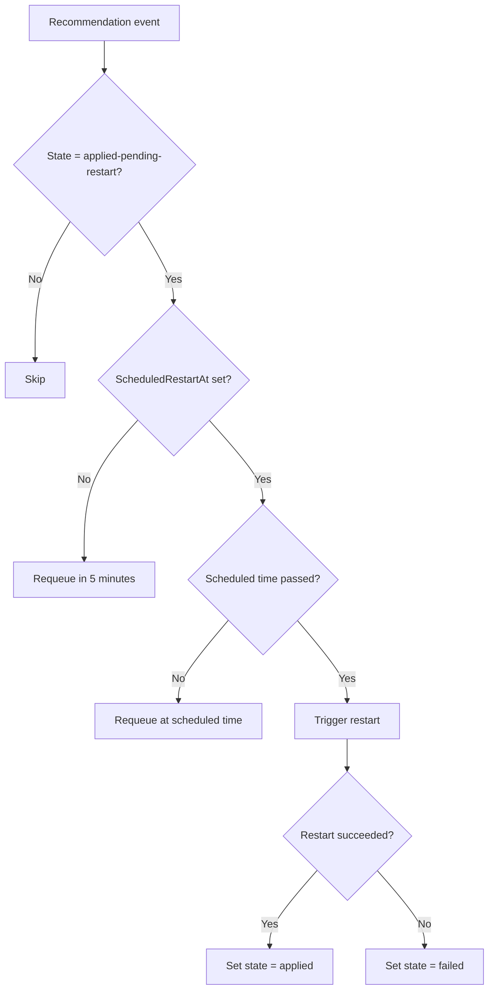

# Chapter 6: Restart Controller

## Introduction

The Restart Controller is a secondary controller that watches `RightsizingRecommendation` resources in the `applied-pending-restart` state and triggers VM restarts when the scheduled time arrives. Think of it as an alarm clock: the admin sets a restart time through the UI, and this controller fires the restart when the alarm goes off.

## How It Works

The controller watches all `RightsizingRecommendation` CRs but only acts on those in `applied-pending-restart` state:

```go
// internal/controller/restart_controller.go

type RestartReconciler struct {
    client.Client
    Scheme  *runtime.Scheme
    Applier VMRestarter
    Log     logr.Logger
}

type VMRestarter interface {
    RestartVM(ctx context.Context, name, namespace string) error
}
```

The `VMRestarter` interface (implemented by the Applier) allows mocking in tests.

## Reconciliation Flow



```go
func (r *RestartReconciler) Reconcile(ctx context.Context, req ctrl.Request) (ctrl.Result, error) {
    rec := &rightsizingv1alpha1.RightsizingRecommendation{}
    if err := r.Get(ctx, req.NamespacedName, rec); err != nil {
        return ctrl.Result{}, nil
    }

    if rec.Status.State != rightsizingv1alpha1.StateAppliedPendingRestart {
        return ctrl.Result{}, nil
    }

    if rec.Status.ScheduledRestartAt == nil {
        return ctrl.Result{RequeueAfter: 5 * time.Minute}, nil
    }

    if rec.Status.ScheduledRestartAt.Time.After(time.Now()) {
        return ctrl.Result{RequeueAfter: time.Until(rec.Status.ScheduledRestartAt.Time)}, nil
    }

    // Time to restart
    if err := r.Applier.RestartVM(ctx, rec.Spec.VirtualMachineRef.Name,
        rec.Spec.VirtualMachineRef.Namespace); err != nil {
        rec.Status.State = rightsizingv1alpha1.StateFailed
        rec.Status.Message = fmt.Sprintf("restart failed: %v", err)
        _ = r.Status().Update(ctx, rec)
        return ctrl.Result{}, err
    }

    now := metav1.Now()
    rec.Status.State = rightsizingv1alpha1.StateApplied
    rec.Status.AppliedAt = &now
    rec.Status.ScheduledRestartAt = nil
    _ = r.Status().Update(ctx, rec)
    return ctrl.Result{}, nil
}
```

Three scenarios:

1. **No scheduled time** — the admin chose "restart later" (manual). The controller requeues every 5 minutes in case the schedule is updated.
2. **Scheduled time in the future** — requeues to fire at exactly the right moment using `time.Until()`.
3. **Scheduled time has passed** — triggers the restart immediately.

On success, the status transitions to `applied`. On failure, it goes to `failed` with an error message.

## Separation from the Recommendation Controller

Why have two controllers? The Recommendation Controller handles the analysis lifecycle (metrics → calculator → CR), while the Restart Controller handles the operational lifecycle (schedule → wait → restart). Separating them keeps each controller focused and testable.

## Key Takeaways

- The Restart Controller watches `RightsizingRecommendation` CRs, not VMs.
- It uses precise `RequeueAfter` timing to fire restarts at the scheduled moment.
- The `VMRestarter` interface decouples it from the Applier for testability.
- Failed restarts are captured in the CR's status for visibility.
- Separation from the Recommendation Controller keeps concerns clean.

## Next Steps

So far, every rightsizing action has been direct: admin clicks "Rightsize", changes are applied. But many organisations need an approval step. Next, we'll look at the Approval Workflow components that enable owner review.
