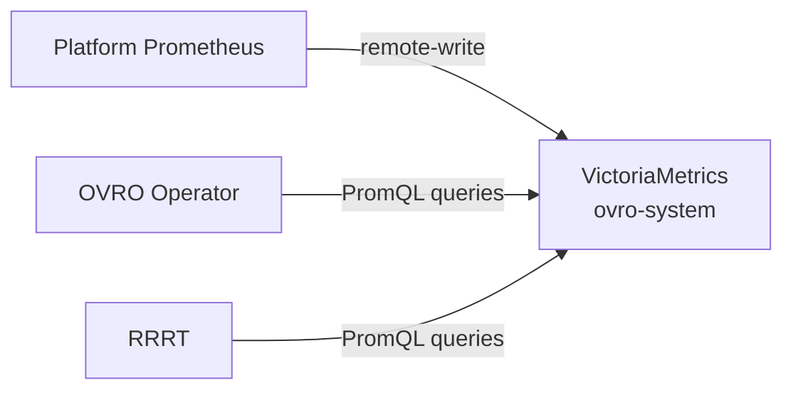

# Chapter 11: VictoriaMetrics Metrics Storage

## Introduction

OVRO uses a dedicated [VictoriaMetrics](https://victoriametrics.com/) instance as its time-series database. Platform Prometheus remote-writes VM and container metrics into VictoriaMetrics, which stores them with configurable long-term retention (default 90 days). This gives OVRO visibility into utilization spikes and seasonal patterns that would be lost with Prometheus's shorter retention window.

VictoriaMetrics is PromQL-compatible, so OVRO's existing Prometheus client queries it without changes.

## Architecture



## Deployment

VictoriaMetrics runs as a single-node StatefulSet in the `ovro-system` namespace:

- **Image**: `docker.io/victoriametrics/victoria-metrics:v1.141.0`
- **Port**: 8428 (HTTP)
- **Storage**: 50Gi PVC (configurable via `RightsizingPolicy.spec.metricsStorage.storageSize`)
- **Retention**: 90 days (configurable via `RightsizingPolicy.spec.metricsStorage.retentionDays`)

A NetworkPolicy restricts ingress to pods in `ovro-system` and `openshift-monitoring` only.

Deploy with:

```bash
oc apply -f deploy/victoriametrics-statefulset.yaml
oc apply -f deploy/victoriametrics-service.yaml
oc apply -f deploy/victoriametrics-networkpolicy.yaml
```

## Prerequisite: Configure Prometheus Remote-Write

A cluster-admin must configure platform Prometheus to forward metrics to VictoriaMetrics. Edit the `cluster-monitoring-config` ConfigMap in `openshift-monitoring`:

```bash
oc -n openshift-monitoring edit configmap cluster-monitoring-config
```

Add the `remoteWrite` section under `prometheusK8s`:

```yaml
apiVersion: v1
kind: ConfigMap
metadata:
  name: cluster-monitoring-config
  namespace: openshift-monitoring
data:
  config.yaml: |
    prometheusK8s:
      remoteWrite:
        - url: "http://victoriametrics.ovro-system.svc:8428/api/v1/write"
          writeRelabelConfigs:
            - sourceLabels: [__name__]
              regex: "kubevirt_vmi_cpu_usage_seconds_total|kubevirt_vmi_memory_resident_bytes|container_cpu_usage_seconds_total|container_memory_working_set_bytes|kube_pod_container_resource_requests|kube_pod_container_resource_limits|kube_node_status_allocatable|kube_node_info|kube_node_status_condition"
              action: keep
```

The `writeRelabelConfigs` with `keep` ensures only the metrics OVRO and RRRT need are forwarded. This avoids overwhelming VictoriaMetrics with the full platform metric set.

### Metrics Forwarded

| Metric | Used By |
|--------|---------|
| `kubevirt_vmi_cpu_usage_seconds_total` | OVRO (VM CPU utilization) |
| `kubevirt_vmi_memory_resident_bytes` | OVRO (VM memory utilization) |
| `container_cpu_usage_seconds_total` | RRRT (container CPU utilization) |
| `container_memory_working_set_bytes` | RRRT (container memory utilization) |
| `kube_pod_container_resource_requests` | RRRT (current resource requests) |
| `kube_pod_container_resource_limits` | RRRT (current resource limits) |
| `kube_node_status_allocatable` | RRRT (cluster overview) |
| `kube_node_info` | RRRT (cluster overview) |
| `kube_node_status_condition` | RRRT (cluster overview) |

## Verifying Metrics Flow

After applying the remote-write config, verify that metrics are arriving in VictoriaMetrics:

```bash
oc -n ovro-system exec deploy/victoriametrics -- \
  wget -qO- 'http://localhost:8428/api/v1/query?query=up'
```

Check a specific KubeVirt metric:

```bash
oc -n ovro-system exec deploy/victoriametrics -- \
  wget -qO- 'http://localhost:8428/api/v1/query?query=count(kubevirt_vmi_cpu_usage_seconds_total)'
```

## RRRT Integration

RRRT queries VictoriaMetrics using the same PromQL interface. Set the environment variable when running RRRT:

```
RRRT_PROMETHEUS_URL=http://victoriametrics.ovro-system.svc:8428
```

No RRRT code changes are needed — VictoriaMetrics is fully PromQL-compatible.

## Key Takeaways

- VictoriaMetrics gives OVRO 90-day metric retention vs Prometheus's ~14 days
- Only metrics OVRO/RRRT need are forwarded via `writeRelabelConfigs`
- Plain HTTP inside the cluster, protected by NetworkPolicy
- PromQL-compatible — no query changes needed in OVRO or RRRT
- Remote-write config is a one-time cluster-admin prerequisite
