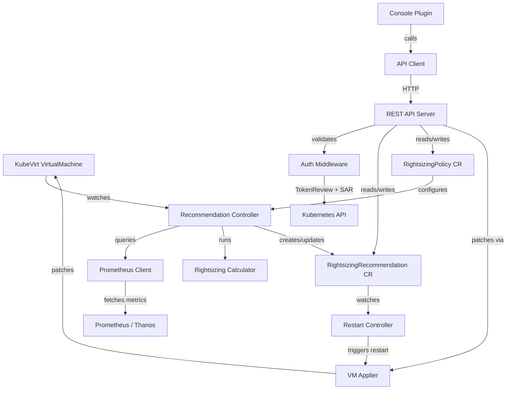

# Welcome to the OVRO Tutorial Series

If you have ever managed a fleet of virtual machines on OpenShift, you already know the problem: **VM sprawl**. Teams request generous CPU and memory allocations "just in case," workloads shift over time, and before long a significant portion of your cluster capacity is reserved but never actually used. The cost -- in hardware, energy, and licensing -- adds up fast.

The **OpenShift Virtualization Rightsizing Operator (OVRO)** exists to solve exactly this. It continuously monitors the real-world utilisation of every KubeVirt `VirtualMachine` in your cluster, calculates data-driven recommendations for right-sizing CPU and memory, and surfaces those recommendations through a polished OpenShift Console plugin so platform teams can act on them with confidence.

No more guesswork. No more spreadsheets. Just *measured utilisation* turned into *actionable recommendations*.

---

## Project Overview

OVRO is a Kubernetes operator built with **Go** and **controller-runtime** that pairs a backend recommendation engine with a **React/PatternFly** frontend delivered as an OpenShift Console dynamic plugin. On the backend, a set of controllers watch `VirtualMachine` objects, query **Prometheus** (or **Thanos**) for historical CPU and memory metrics, and feed those metrics into a rightsizing calculator that uses a **P95 + headroom algorithm** to produce safe, defensible resize recommendations. Those recommendations are persisted as `RightsizingRecommendation` Custom Resources. A dedicated restart controller can optionally apply changes and restart affected VMs automatically, governed by `RightsizingPolicy` Custom Resources that give administrators fine-grained control.

On the frontend, an RBAC-enforced REST API exposes recommendations, policies, and exclusion lists to the Console plugin, which provides four main views: **Overview**, **Recommendations**, **Excluded VMs**, and **Policy**. Authentication flows through Kubernetes `TokenReview` and `SubjectAccessReview`, so every API call respects the caller's existing OpenShift permissions.

---

## Architecture Overview

The diagram below shows how the major components interact. The operator controllers sit at the centre, bridging metric collection, recommendation storage, and the Console plugin.

**Key data flows:**

- The *Recommendation Controller* watches every `VirtualMachine`, pulls utilisation metrics from Prometheus, runs the rightsizing calculator, and writes `RightsizingRecommendation` CRs.
- The *Restart Controller* watches recommendations and, when policy allows, patches the VM spec and triggers a controlled restart via the *VM Applier*.
- The *Console Plugin* communicates with the REST API server, which enforces RBAC through Kubernetes-native `TokenReview` and `SubjectAccessReview` checks before reading or writing any resource.

---

## Technical Stack

| Layer | Technology |
|---|---|
| **Language (backend)** | Go 1.26 |
| **Operator framework** | controller-runtime |
| **Virtualisation API** | KubeVirt API |
| **Metrics source** | Prometheus / Thanos |
| **Language (frontend)** | TypeScript |
| **UI framework** | React 18 |
| **Design system** | PatternFly 6 |
| **Bundler** | webpack |
| **CI/CD** | Tekton |
| **Platform** | OpenShift |

---

## What You Will Learn

By working through these tutorials you will gain hands-on experience with:

- **Designing Kubernetes Custom Resource Definitions** -- defining the `RightsizingRecommendation` and `RightsizingPolicy` CRDs and understanding their role in the operator pattern
- **Building a multi-controller operator with controller-runtime** -- setting up manager, reconcilers, watches, and event filters in Go
- **Querying Prometheus programmatically** -- constructing PromQL queries for CPU and memory utilisation and handling the Prometheus HTTP API from Go
- **Implementing a rightsizing algorithm** -- applying P95 percentile analysis with configurable headroom to produce safe resize recommendations
- **Enforcing RBAC in a custom REST API** -- using Kubernetes `TokenReview` and `SubjectAccessReview` to validate every incoming request against the caller's permissions
- **Building an OpenShift Console dynamic plugin** -- scaffolding a React/TypeScript plugin, registering extensions, and integrating with the Console's navigation and resource pages
- **Working with PatternFly 6 components** -- building data tables, dashboards, forms, and filter toolbars following Red Hat's design system
- **Setting up Tekton CI/CD pipelines** -- creating build, test, image-build, and image-push tasks that run automatically on every commit
- **Testing and iterating on a real operator** -- writing unit tests, integration tests, and using `envtest` to validate controller behaviour without a live cluster

---

## Prerequisites

Before diving in, make sure you are comfortable with the following:

- **OpenShift fundamentals** -- You should know how to navigate the OpenShift web console, work with projects and namespaces, and use the `oc` CLI for common operations.
- **Go basics** -- You do not need to be an expert, but you should be familiar with Go modules, structs, interfaces, and error handling. If you can read and modify a Go program, you are ready.
- **React basics** -- Understanding of components, hooks (`useState`, `useEffect`), and props. Experience with TypeScript is helpful but not strictly required -- we will explain type annotations as they appear.
- **Kubernetes Custom Resources** -- A general understanding of what CRDs are and how controllers reconcile desired state with actual state. If you have ever written or read an operator before, you are in great shape.

If any of these areas feel unfamiliar, we recommend spending an hour or two with the official documentation for that topic before continuing. Each tutorial chapter will link to relevant reference material as well.

---

*Ready to get started? Head to the next chapter to set up your development environment and deploy your first build of OVRO.*
