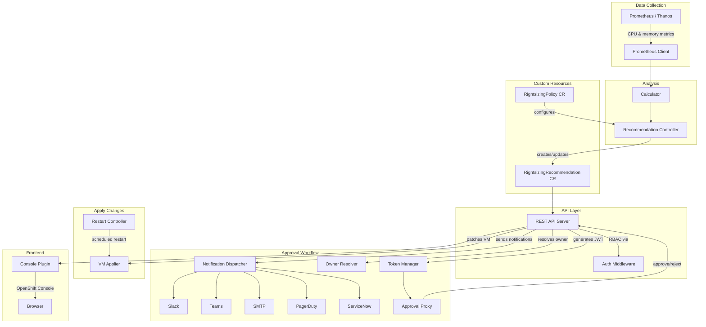

# OVRO - OpenShift Virtualization Rightsizing Operator

Welcome to the OVRO tutorial! This guide walks you through the architecture and implementation of a Kubernetes operator that analyses KubeVirt virtual machine resource utilisation and recommends CPU/memory rightsizing changes. By the end, you'll understand how every component works together, from metrics collection through the approval workflow to the OpenShift Console UI.

## What Does OVRO Do?

Imagine you're running dozens of virtual machines on OpenShift. Some VMs were provisioned with 8 CPU cores but only use 2. Others are maxing out their memory. OVRO acts like a resource advisor: it watches your VMs, queries Prometheus for historical usage data, computes whether each VM is over- or under-provisioned, and presents actionable recommendations through the OpenShift Console.

Cluster administrators can then apply changes directly (with live hotplug when supported), schedule restarts for non-hotplug VMs, or route changes through an approval workflow where VM owners review and approve recommendations via a signed link.

## Architecture Overview



## Technical Stack

| Technology | Purpose |
|------------|---------|
| **Go 1.23** | Backend operator, API server, approval proxy |
| **controller-runtime** | Kubernetes controller framework |
| **KubeVirt** | Virtual machine management on Kubernetes |
| **Prometheus / Thanos** | Metrics collection and querying |
| **React + TypeScript** | Console plugin frontend |
| **PatternFly 5** | Red Hat's UI component library |
| **OpenShift Console SDK** | Dynamic plugin integration |
| **JWT (HMAC-SHA256)** | Approval token signing and validation |

## Project Structure

```
ovro/
  api/v1alpha1/          # CRD type definitions (Go structs + kubebuilder markers)
  cmd/
    main.go              # Operator entrypoint (manager + API server)
    approval-proxy/      # Standalone approval proxy binary
  internal/
    apiserver/           # REST API (handlers, middleware, server)
    applier/             # VM patching via dynamic client
    approval/            # JWT token manager
    approvalproxy/       # Approval page server (HTML templates)
    calculator/          # Rightsizing analysis algorithm
    controller/          # Kubernetes controllers (recommendation + restart)
    notifier/            # Multi-channel notification forwarders
    owner/               # VM owner resolution from labels
    prometheus/          # Prometheus/Thanos query client
  console-plugin/        # React/TypeScript OpenShift Console plugin
    src/
      api/               # API client (consoleFetch wrapper)
      components/        # PatternFly UI components
```

## What You'll Learn

- How Kubernetes Custom Resource Definitions (CRDs) model domain concepts
- How controller-runtime reconciliation loops work with non-native resources (KubeVirt VMs)
- Querying Prometheus programmatically for time-series utilisation data
- Building a REST API server that integrates with Kubernetes RBAC
- Implementing a JWT-based approval workflow with multi-channel notifications
- Creating an OpenShift Console dynamic plugin with React and PatternFly

## Prerequisites

- Familiarity with Go and basic Kubernetes concepts (Pods, Namespaces, CRDs)
- Some exposure to React/TypeScript (for the frontend chapters)
- Understanding of REST APIs and HTTP

Let's start by looking at how OVRO models its data with Custom Resource Definitions.
